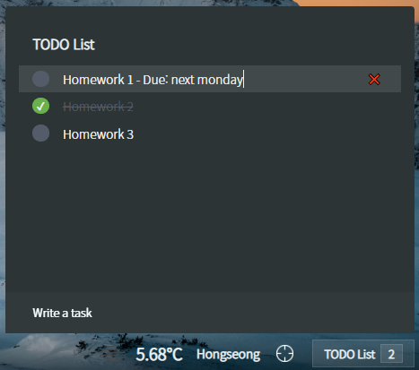

# Welcome Page

Welcome page with clock, weather-widget, and todo list!

1. [Clock and Greeting](#Clock-and-Greeting)
2. [Todo List](#Todo-List)
3. [Weather](#Weather)

This page stores data in your local storage. You can find items stored in the local storage on F12 > Application tab > Local Storage. 'currentUser' is a user name on a greeting message. 'toDos' is a json list of todo-entry. 'currentCoords' has latitude-longitude information of your machine.

## Clock and Greeting

24-hour clock in the center of the page.

You can write your name in the input box below the clock. This page will store your name and print a greeting message.

## Todo List

Todo list button at the bottom right of the page. You can click it to open the todo list.

Write your tasks and press an enter key. Your task will be added to the list.

You can click the circle and mark it as done. You may want to edit your tasks. Just click and edit it. Also, you can click 'x' button to remove it.

## Weather

Weather widget at the bottom right of the page. You can click it to check weather informations. GPS button to the right of the weather button. You can click it to reload your location.

It uses [OpenWeather API](https://openweathermap.org/) to get the weather info.

